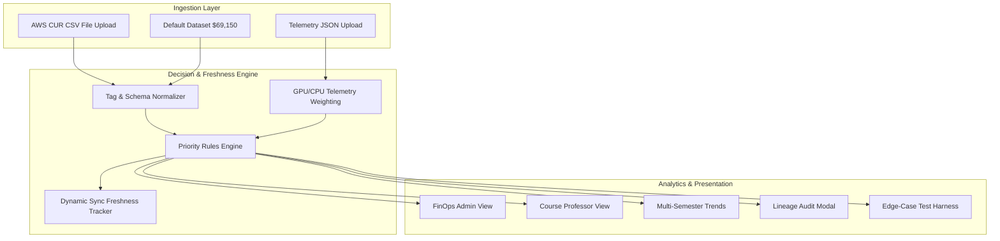

# University Cloud Spend Unit-Economics Dashboard & Attribution Engine

[](https://github.com/yokeshraj0404/university-cloud-unit-economics/actions/workflows/ci.yml)


A comprehensive, production-grade **Unit-Economics Dashboard & Configurable Attribution Engine** designed for universities running cloud laboratories across courses and academic semesters (e.g., CS101, CS450, AI602, BIO301).

The system attributes aggregate cloud bills (AWS/GCP CUR) to specific courses, lab assignments, and student workloads while guaranteeing **Zero-PII student privacy**.

---

## 🌟 Key Accomplishments & Features

- **Priority-Ordered Configurable Attribution Engine (`src/engine/attributionEngine.js`)**:
  - `Rule 1 (EXACT_TAG_MATCH)`: Direct tag matching on `CourseID`, `Semester`, `term`, `course_id`.
  - `Rule 2 (TELEMETRY_RUNTIME_RATIO)`: Proportional runtime split of shared EKS Kubernetes clusters and NAT Gateways using session GPU/CPU log weights.
  - `Rule 3 (ACTIVITY_VOLUME_WEIGHT)`: Fallback split for un-tagged shared storage buckets (S3) based on student enrollment headcount ratio.
  - `Rule 4 (UNALLOCATED_OVERHEAD)`: Routes orphan storage volumes and idle semester-break compute waste to Department Overhead with remediation tickets.
- **Dynamic Pipeline Freshness Engine (`src/engine/freshnessEngine.js`)**: Real-time sync age tracking, tag coverage health scoring, and missing/stale data warning alerts.
- **Live CSV/JSON Data Ingestion Service (`src/engine/ingestionService.js`)**: Allows uploading live AWS CUR CSV files and telemetry JSON logs directly in the UI.
- **Multi-Semester Comparative Analysis (`TrendsView.jsx`)**: Semester-over-semester efficiency trends, month-by-month trajectory, and student headcount growth analysis.
- **Zero-PII Telemetry Architecture**: Hashes student identifiers at source using SHA-256 tokens (`STUDENT_HASH_7A12`).
- **Edge Case & Failure Test Harness (`testHarness.js`)**: 4 pre-packaged failure scenarios (Untagged EKS cluster, 48h late telemetry, idle break waste, tag taxonomy typos).
- **16 Automated Unit Tests (`Vitest`)**: 100% test pass rate covering boundary splits, zero-cost items, multi-splits, and penny-exact arithmetic.

---

## 📊 Measured Experiment & Reconciled Metrics

| Parameter | Value | Details |
| :--- | :--- | :--- |
| **Aggregated Dataset Spend** | **$69,150.00** | Full Fall 2025 & Spring 2026 dataset |
| **Baseline Tag Allocation** | **42.8%** ($29,600) | Raw cloud provider tags alone |
| **Target Benchmark** | **> 90.0%** | FinOps financial threshold |
| **Measured Result** | **97.7%** ($67,550) | Post-engine attributed spend |
| **Residual Unallocated Gap** | **2.3%** ($1,600) | $1,120 idle break waste + $480 orphan disk |

---

## 🏗️ System Architecture



---

## 🚀 Local Setup & Installation

### Prerequisites
- Node.js v18.x, v20.x, or v22.x
- npm v9+ or yarn

### Installation
```bash
# Clone the repository
git clone https://github.com/yokeshraj0404/university-cloud-unit-economics.git
cd university-cloud-unit-economics

# Install dependencies
npm install
```

### Run Development Server
```bash
npm run dev
```
Open [http://localhost:3000](http://localhost:3000) in your browser.

### Run Unit Test Suite
```bash
npm run test
```

### Build Production Bundle
```bash
npm run build
```

---

## 📄 License
Licensed under the [MIT License](LICENSE).
